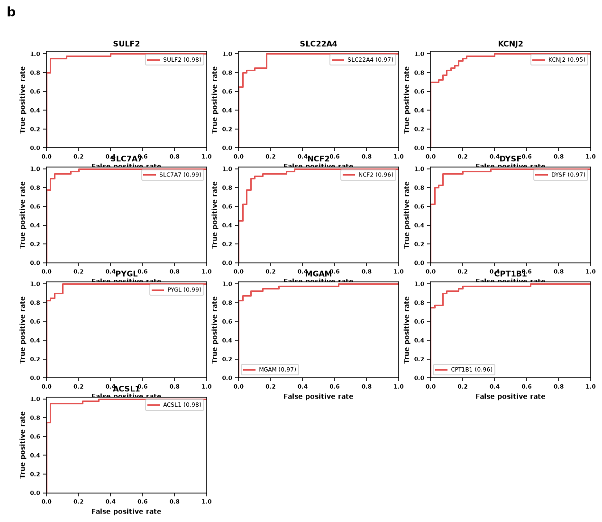
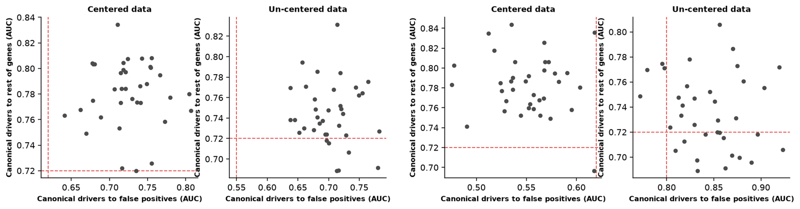

# Examples

Longer copy-ready prompts are in [docs/PROMPT_LIBRARY.md](../../../docs/PROMPT_LIBRARY.md). Worked synthetic cases are in [docs/USAGE_GUIDE.md](../../../docs/USAGE_GUIDE.md).

- “Plot normalized MTT viability for six doses with individual replicates, uncertainty, and multiple-comparison results.” Route to a dose-response curve. Required columns: dose, value.
- “Compare AUROC, F1, and MCC across five models and three cohorts.” Route to grouped bars when the table already holds the metrics. Required columns: value, group.
- “Show whether AD and control samples separate in PCA and display the variance explained.” Route to PCA. Required columns: feature, sample, value, plus group for colour.
- “Create a publication-ready heatmap of significant miRNA–target associations.” Route to a heatmap. Required columns: feature, sample, value.
- “Generate a Kaplan–Meier plot with number-at-risk table and hazard-ratio annotation.” Route to Kaplan–Meier. Required columns: time, event, group.

Run `PYTHONPATH=src python examples/plot_two_groups.py` for a synthetic two-group figure.

Standalone and grouped style examples, selected by family exemplar grade, are in [examples/EXAMPLES.md](examples/EXAMPLES.md).

