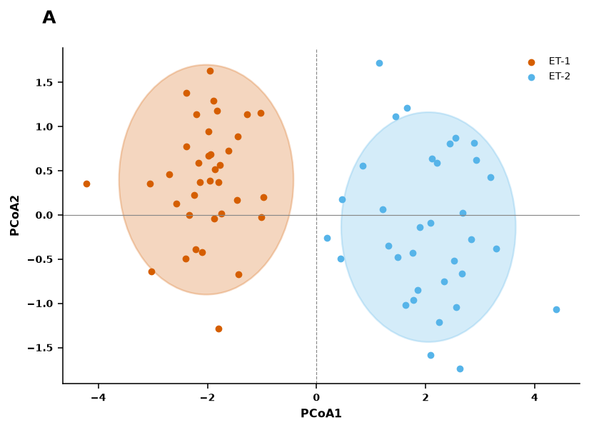
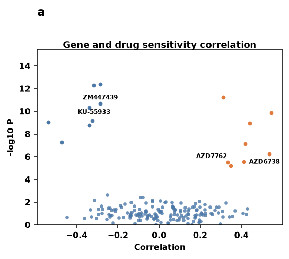
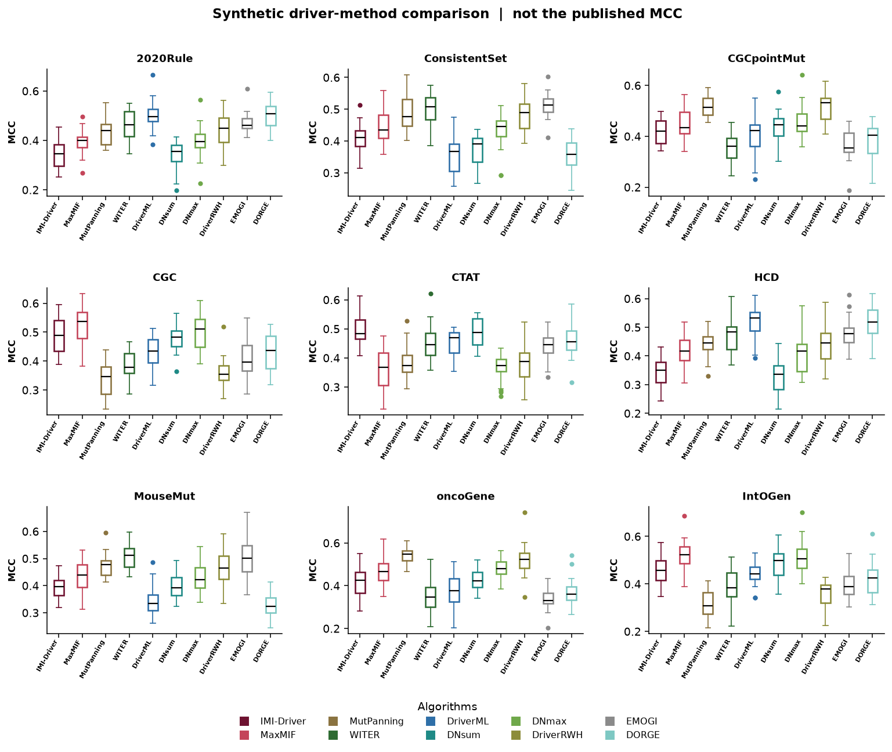

# Bioinformatics visualization skill

This repository is a Cursor skill and a small Python plotting library. Use it in a new bioinformatics project when you have tidy tables from several experiments, datasets, or models and you need a figure that matches the scientific question.

It recommends a plot family and can draw the renderers listed in [docs/DATA_SCHEMAS.md](docs/DATA_SCHEMAS.md). It does not download papers or run DESeq2, a Cox model, or a mixed model. Atlas template grades are visual preferences, not proof that a test fits your study.

Start here: [docs/QUICK_START.md](docs/QUICK_START.md).

- Full guide: [docs/USAGE_GUIDE.md](docs/USAGE_GUIDE.md)
- Columns and renderer mismatches: [docs/DATA_SCHEMAS.md](docs/DATA_SCHEMAS.md)
- Copy-ready prompts: [docs/PROMPT_LIBRARY.md](docs/PROMPT_LIBRARY.md)
- Skill instructions: [.cursor/skills/bioinformatics-visualization/SKILL.md](.cursor/skills/bioinformatics-visualization/SKILL.md)

## Install

```bash
git clone https://github.com/CyrilleMesue/bioinformatics-visualization-skill.git
cd bioinformatics-visualization-skill
python -m pip install -r requirements.txt
export PYTHONPATH=src
python -c "from bioinformatics_visual_evidence_atlas.visualization import recommend; print('ok')"
```

Copy `.cursor/skills/bioinformatics-visualization` into the project where you will chat. There is no `[build-system]` entry, so do not rely on `pip install -e .`.

## Minimal data and prompt

Synthetic rows in [data_templates/group_comparison_long.csv](data_templates/group_comparison_long.csv). One row is one sample.

```text
Primary question: Does the treated group differ from control?
File: data_templates/group_comparison_long.csv
One row is one independent sample. Columns: group, value.
Panel mode: single.
```

Panel modes (`single`, `auto`, `specified`) and the three candidate designs are instructions to the agent. They are not function arguments. `figures.render` writes PNG, SVG, PDF, `plotting_data.csv`, `caption.txt`, and `audit.json`.

## What the code does and does not do

Implemented: routing, template lookup from `milestone_8/template_rankings.json`, and the renderers in `visualization/figures.py`. Agent-guided: panel planning, candidate comparison, and an accessibility write-up. Not implemented: paired plots, UMAP, Cox models, and a volcano that reads DESeq2 output. Details are in the usage guide.

Do not fabricate microscopy, blots, or molecular structures. Do not present a synthetic figure as a published result.

## Sample plots

These are synthetic reproductions graded 10. Standalone panels and grouped panels are separate. The full set, every grade 9 and 10 plus a grade 8 when that is the top grade in its family, is in [.cursor/skills/bioinformatics-visualization/examples/EXAMPLES.md](.cursor/skills/bioinformatics-visualization/examples/EXAMPLES.md).

After a figure is drawn, compare it with the examples for that family. The result should be as clear: readable type, panel letters free of titles and legends, visible uncertainty, and space between panels. A grade 10 is not automatic. Use a grade 9 example when its layout stays readable and the grade 10 layout is crowded.

### Standalone panels






### Grouped panels



